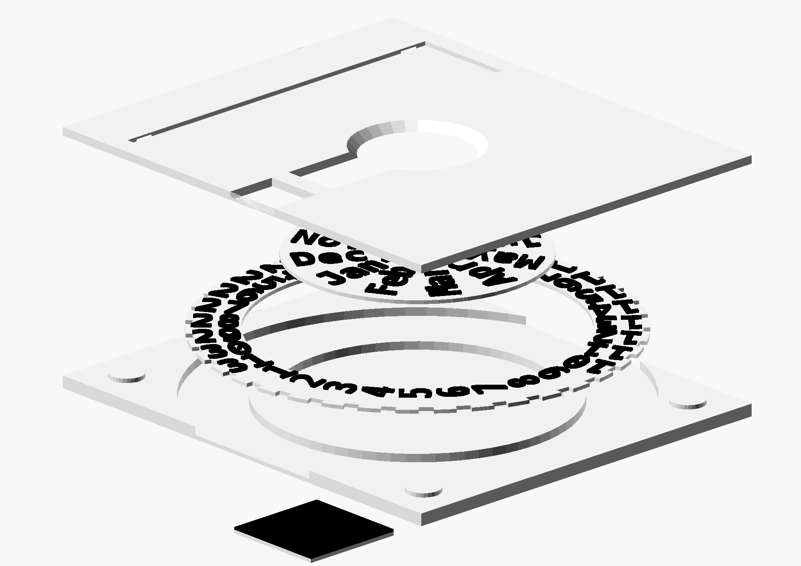

# reminder-plate

_For all those things you forgot when you did last_.



## What's this?

It's a small plate that you can attach with Blu Tack to walls etc around the house, serving to remind you of various regular tasks.

It has a cut-out for attaching a label to it. I might produce a printable insert for the label slot in the future (unless _you_ beat me to it).


## Printing and assembly

Print in at least two passes: the top and bottom plate can be printed in a single colour, and the wheels can be printed together.

The wheels are meant to be printable on a one-colour printer, but you'll have to change filament at the right time. Use your slicer's ability to insert filament changes and manually purge between colours.


## Customisability

It may be possible to scale this uniformly, but there's a lot more customisation possible in the OpenSCAD source file. A number of parameters can be readily tweaked.

A Makefile is included. On GNU/Linux systems, you can build the `.stl`'s by simply running e.g.
```
make -j8
```


## Future improvements, maybe?

Ideas that come to mind:

- Ratchet mechanism or nubs to make the wheels click into place.
- Snap-fit instead of Blu-Tack'ing the layers together.


## Example use cases

Generally, you'll want to describe the purpose and an intended interval on the label. Then, you'd use the date selector to show when it was last carried out (or alternatively, when it needs to be done next---you'll want to write which of the two, on the label).

- When was the {fridge,cat litter box,bathroom,garage,...} cleaned last?

- When is next date night?

- When was the box of washing agent opened?

Small businesses may have purposes for these as well:

- When is it time to drop off cash at the bank again?

- When was the office kitchen restocked last?

- When was the men's room inspected last? (Customise months/days into hours/minutes.)


... but really, it's up to your imagination.
